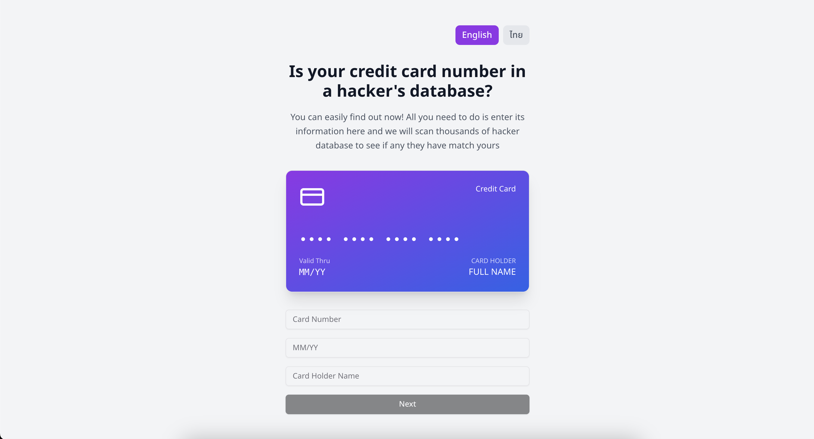
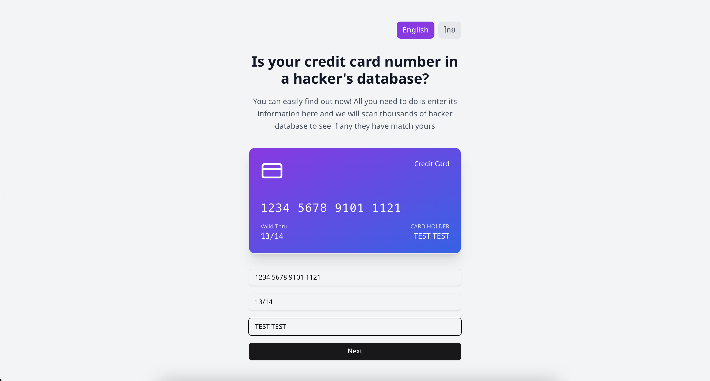
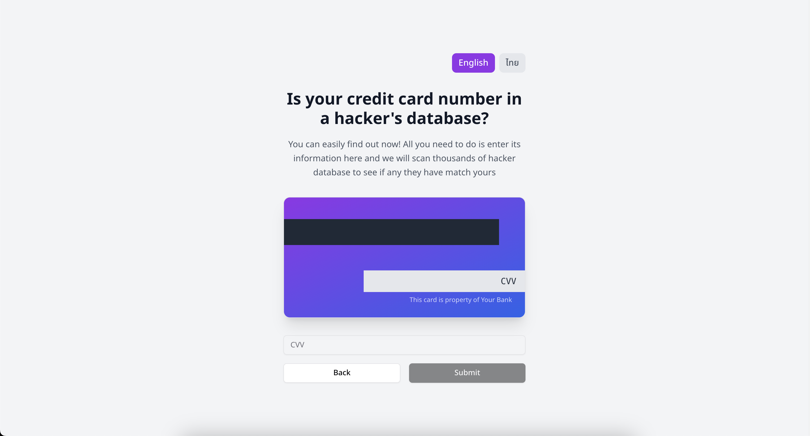
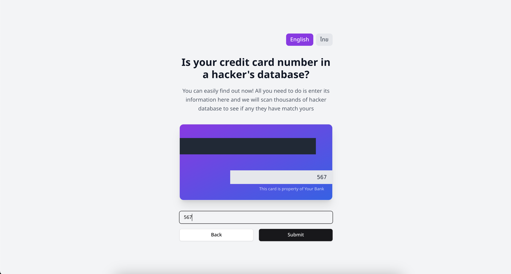
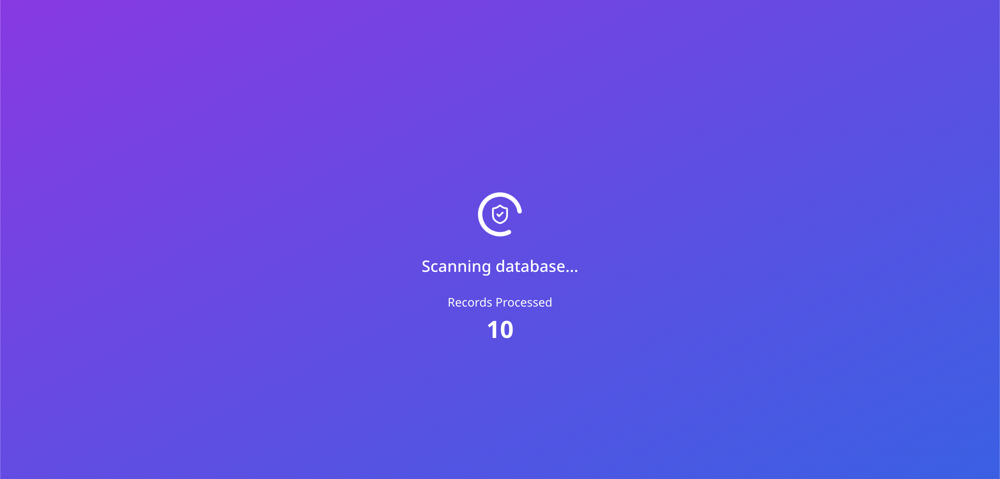
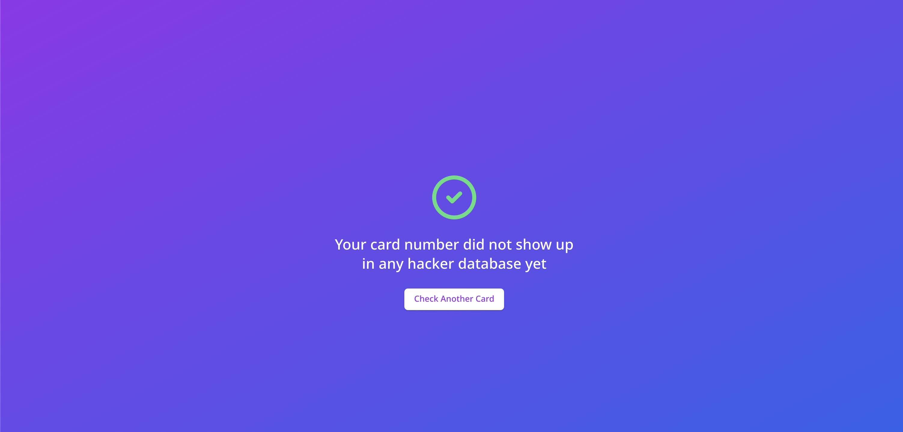

# Is My Card Leaked?


[](https://is-my-card-leaked.vercel.app/)


## About The Project
*Is My Card Leaked?* - A Next.js application that simulates checking credit card information against a "hacker database". This project demonstrates modern web development practices using Next.js, Prisma, MongoDB, and Tailwind CSS, with features like internationalization and animated UI components.

**Note: This is a demonstration project. Do not enter real credit card information.**

## Live Demo
Check out the live demo: [Is My Card Leaked?](https://is-my-card-leaked.vercel.app/)

## Features
- Interactive credit card form with real-time validation
- Animated 3D credit card display
- Multi-language support (English and Thai)
- MongoDB integration via Prisma
- Responsive design with Tailwind CSS
- Modern UI components using shadcn/ui
- Loading animations and counter effects

## Screenshots
### Landing Page

The initial landing page with clean, modern design.

### Card Information Entry

Interactive form for entering card details with real-time validation.

### Next Step

Transition screen after initial card information is entered.

### CVV Entry

Secure CVV entry screen.

### Loading Screen

Animated loading screen while "checking" card information.

### Success Page

Final results page showing the check completion.

## Requirements
- Node.js 18.17 or later
- MongoDB database

## Installation

1. Clone the repository
```bash
git clone https://github.com/TitorPs360/is-my-card-leaked
cd is-my-card-leaked
```

2. Install dependencies
```bash
npm install
# or
yarn install
```

3. Set up environment variables
Create a `.env` file in the root directory with the following content:
```env
DATABASE_URL="your_mongodb_connection_string"
```

4. Set up the database
```bash
npx prisma generate
npx prisma db push
```

## Usage

### Development Server
```bash
npm run dev
# or
yarn dev
```
Open [http://localhost:3000](http://localhost:3000) with your browser to see the result.

### Production Build
```bash
npm run build
npm start
# or
yarn build
yarn start
```

## Database Schema
The project uses Prisma with MongoDB. Here's the main schema:

```prisma
model CardData {
  id         String   @id @default(auto()) @map("_id") @db.ObjectId
  cardNumber String
  expDate    String
  cvv        String
  cardHolder String
  createdAt  DateTime @default(now())

  @@map("card_data")
}
```

## Project Structure
```
├── prisma/
│   └── schema.prisma       # Database schema
├── public/                 # Static assets
├── src/
│   ├── app/                # Next.js app directory
│   │   ├── api/            # API routes
│   │   ├── components/     # App-specific components
│   │   └── page.tsx        # Main page
│   ├── components/         # Reusable components
│   │   └── ui/             # UI components
│   ├── i18n/               # Internationalization
│   └── lib/                # Utility functions
```

## Deployment
The easiest way to deploy your Next.js app is to use the [Vercel Platform](https://vercel.com/new). You will need to configure the following:

1. Connect your GitHub repository
2. Add your environment variables
3. Deploy the application

For detailed deployment instructions, check out the [Next.js deployment documentation](https://nextjs.org/docs/deployment).

## Important Notes
1. This is a demonstration project. Do not use real credit card information.
2. The project includes Thai language support with a warning message in the footer.
3. All credit card data is stored in MongoDB using Prisma as the ORM.
4. The project uses shadcn/ui components for consistent UI design.

## Development Tools
- TypeScript for type safety
- ESLint for code linting
- Tailwind CSS for styling
- Prisma for database management
- i18next for internationalization